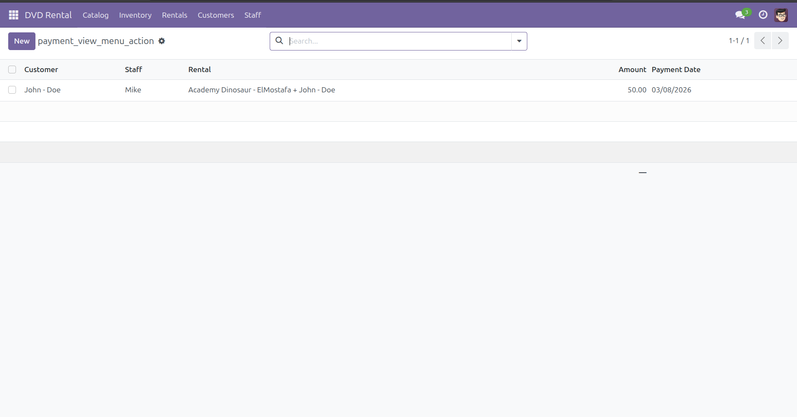
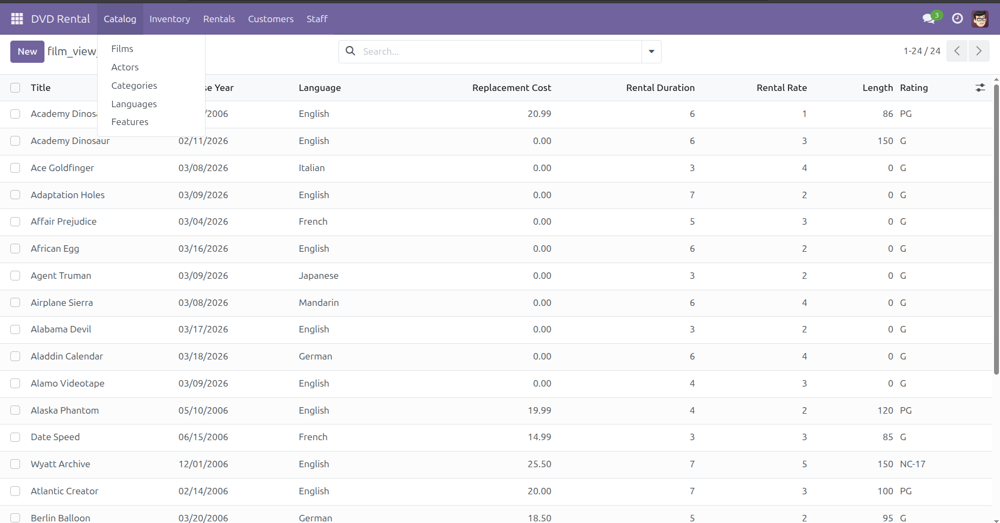
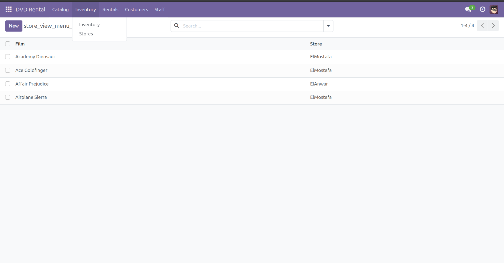
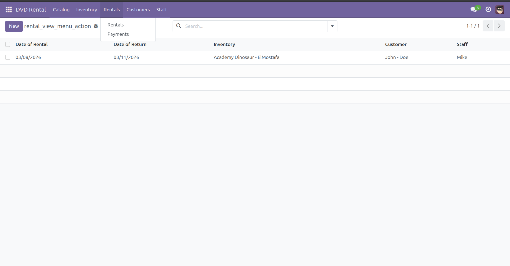
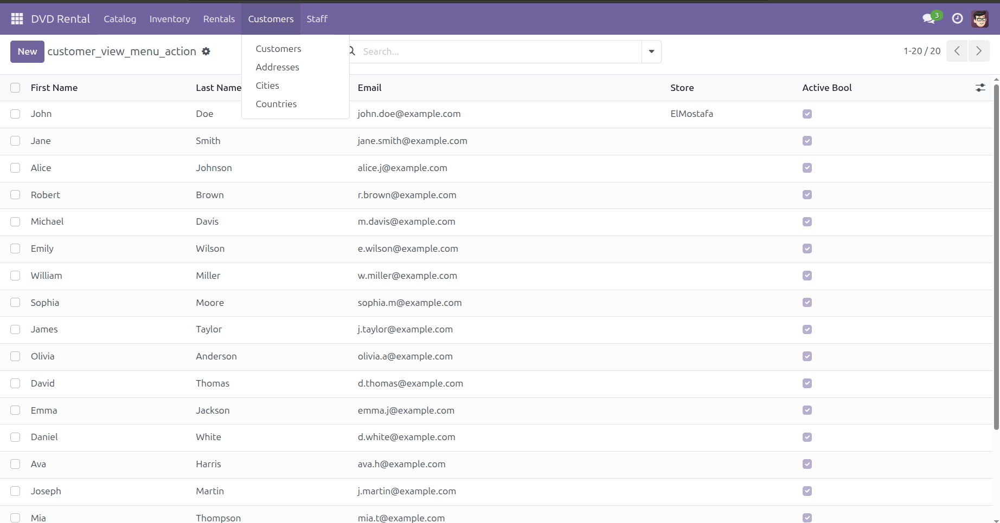
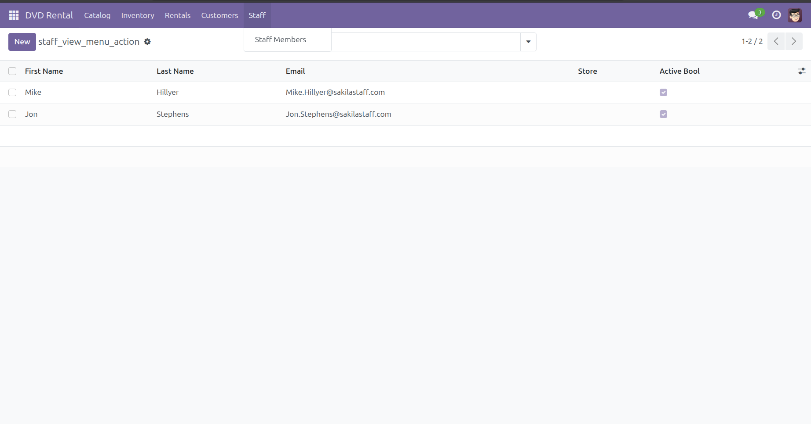

# DVD Rental Odoo Module

This module implements a DVD rental management system in Odoo.

## Features

- Manage Films
- Manage Actors
- Manage Categories
- Manage Customers
- Rental Management
- Payment Tracking

## Models

- Film
- Actor
- Category
- Inventory
- Rental
- Payment
- Customer
- Address
- City
- Country
- Store
- Staff

## Screenshots

## Installation

1. Copy module to Odoo addons folder
2. Update Apps List
3. Install **DVD Rental**

## Author

Mahmoud No3man